## 1. Overview

The `viable-swarm-model` skill transforms Kimi Code CLI into a self-organizing,
learning cybernetic development team. Based on Stafford Beer's Viable System
Model (VSM) and Gordon Pask's Conversation Theory, it coordinates specialist
agents through structured phases.

The swarm functions as a learning organism: it reads lessons from previous
sessions, applies prevention rules, and appends new findings to project-local
memory.

**Primary invocation**: `/flow:viable-swarm-model` executes the full workflow.  
**Reference loading**: `/skill:viable-swarm-model` loads knowledge without execution.

## 2. How to Invoke This Skill

- **`/flow:viable-swarm-model`** — Execute the full VSM workflow. The model
  follows the Mermaid flow diagram step-by-step, outputting `<choice>branch</choice>`
  at decision nodes to select paths.
- **`/skill:viable-swarm-model`** — Load as knowledge reference. Use when you
  need patterns, anti-patterns, or checklists without triggering the full workflow.

## 3. VSM Role Map with Custom Sub-Agent Types

| VSM System | CLI Implementation | Custom Type | Activation | Produces |
|---|---|---|---|---|
| **S5 (Policy)** | Main conversation agent | — | Always | Decisions, escalation |
| **S4 (Intelligence)** | `vsm_architect` subagent | Custom | Phase 1 | Architecture doc, API spec |
| **S3 (Control)** | Main agent via SetTodoList | — | All phases | Progress tracking |
| **S3* (Audit)** | `vsm_auditor` subagent | Custom | After waves | PASS/ISSUES/BLOCKER |
| **S2 (Coordination)** | `vsm_coordinator` subagent | Custom | After Wave 3 | Integration report |
| **S1-Backend** | `coder` subagent | Built-in | Phases 2,3 | Backend code |
| **S1-Frontend** | `coder` subagent | Built-in | Phases 2,3 | Frontend code |
| **S1-Tester** | `vsm_tester` subagent | Custom | Phase 4 | Tests, coverage |
| **S1-Security** | `vsm_security` subagent | Custom | Phase 6 | Security findings |
| **S1-DevOps** | `coder` subagent | Built-in | Phase 4 | Docker, CI/CD |
| **Algedonic** | Main agent detects/stops | — | Any phase | TaskStop, AskUserQuestion |

### Custom Type Prompt Characteristics

**`vsm_architect`** (S4 Intelligence): Reads codebase, researches tech, produces
 design documents ONLY (never code). Validates against S5 policy. Full prompt:
 see `references/custom-agent-prompts.md`.

**`vsm_auditor`** (S3* Audit): Read-only. Reads EVERY source file. Produces
PASS/ISSUES/BLOCKER per file. Checks correctness, security, performance,
maintainability. Includes full cross-file checklist. Full prompt:
see `references/custom-agent-prompts.md`.

**`vsm_coordinator`** (S2 Coordination): Read-only. Compares S1 outputs.
Validates imports, interfaces, naming, type alignment. Checks WebSocket contracts,
GraphQL SDL, Prisma relations, env vars. Full prompt:
see `references/custom-agent-prompts.md`.

**`vsm_security`** (Security Audit): Read-only security specialist. Runs 15+
point security checklist. Prevents, not detects — knows all 37 anti-patterns.
Full prompt: see `references/custom-agent-prompts.md`.

**`vsm_tester`** (S1 Quality): Reads implementation, writes tests (unit,
integration, edge cases). Bug-Fix Bonus: fixes bugs inline. Runs tests via
Shell. Full prompt: see `references/custom-agent-prompts.md`.

## 4. The Golden Rule of Parallelism

```
Independent subagents -> run_in_background=true (parallel, up to 4)
Dependent subagents   -> sequential (TaskOutput block=true before next)
```

## 5. Executable Flow Diagram

When invoked via `/flow:viable-swarm-model`, follow this diagram. At diamond

```mermaid
flowchart TD
    BEGIN([BEGIN])
    P0[Phase 0: Viability Check<br/>S5 Main Agent]
    P0D{<choice>trivial</choice>?}
    P0R[Read .kimi/lessons.md<br/>Write plan.md]
    P1[Phase 1: Intelligence<br/>vsm_architect subagent]
    P1H{<choice>S3/S4 deadlock</choice>?}
    P1A[EnterPlanMode<br/>User Approval]
    P1D{<choice>approved</choice>?}
    P2[Phase 2: Foundation Wave<br/>2-3 coder agents<br/>run_in_background=true]
    P2S[TaskOutput block=true]
    P2A[Phase 2b: Audit<br/>vsm_auditor]
    P2D{<choice>BLOCKERs</choice>?}
    P3[Phase 3: Implementation Wave<br/>Parallel coder agents]
    P3S[TaskOutput block=true]
    P3A[Phase 3b: Audit + Coordination<br/>vsm_auditor + vsm_coordinator]
    P3D{<choice>BLOCKERs</choice>?}
    P3E[Entry Point Wiring<br/>MANDATORY]
    P4[Phase 4: Testing + Infra Wave<br/>vsm_tester + coder]
    P4S[TaskOutput block=true]
    P4R[Shell: run tests]
    P5[Phase 5: Integration Verification<br/>vsm_coordinator + vsm_auditor]
    P5D{<choice>ANY failure</choice>?}
    P6[Phase 6: Security Gate<br/>vsm_security]
    P6D{<choice>CRITICAL/HIGH</choice>?}
    P6L[Document LOW as<br/>known limitation]
    P7[Phase 7: Fix Wave<br/>coder agents]
    P7R[Re-audit changed files]
    P7D{<choice>BLOCKERs remain<br/>iterations < 3</choice>?}
    P7E[Escalate to User<br/>AskUserQuestion]
    P8[Phase 8: Reflection<br/>Append to .kimi/lessons.md]
    END([END])

    BEGIN --> P0
    P0 --> P0R
    P0R --> P0D
    P0D -->|<choice>yes</choice>| END
    P0D -->|<choice>no</choice>| P1
    P1 --> P1H
    P1H -->|<choice>yes</choice>| P1
    P1H -->|<choice>no</choice>| P1A
    P1A --> P1D
    P1D -->|<choice>rejected</choice>| P1
    P1D -->|<choice>approved</choice>| P2
    P2 --> P2S
    P2S --> P2A
    P2A --> P2D
    P2D -->|<choice>yes</choice>| P7
    P2D -->|<choice>no</choice>| P3
    P3 --> P3S
    P3S --> P3A
    P3A --> P3D
    P3D -->|<choice>yes</choice>| P7
    P3D -->|<choice>no</choice>| P3E
    P3E --> P4
    P4 --> P4S
    P4S --> P4R
    P4R --> P5
    P5 --> P5D
    P5D -->|<choice>yes</choice>| P3
    P5D -->|<choice>no</choice>| P6
    P6 --> P6D
    P6D -->|<choice>yes</choice>| P7
    P6D -->|<choice>LOW only</choice>| P6L
    P6D -->|<choice>none</choice>| P8
    P6L --> P8
    P7 --> P7R
    P7R --> P7D
    P7D -->|<choice>yes</choice>| P7
    P7D -->|<choice>no, max reached</choice>| P7E
    P7D -->|<choice>no, all clear</choice>| P8
    P7E --> END
    P8 --> END
```

decision nodes, output `<choice>branch name</choice>` to select the next step.



## 6. Phase Details

### Phase 0: Viability Check
Main agent (S5) self-check: trivial (<50 lines, one file)? If yes, respond
directly. If non-trivial, read `.kimi/lessons.md` if exists. Write `plan.md`.

### Phase 1: Intelligence (S4)
Spawn `vsm_architect` subagent. Review output. S3/S4 homeostat: max 3
iterations before escalating to S5. EnterPlanMode for user approval.
Rejected plans loop back.

### Phase 2: Foundation Wave
Spawn 2-3 `coder` subagents with `run_in_background=true`. Wait via
`TaskOutput(block=true)`. Then spawn `vsm_auditor`. BLOCKERs trigger Phase 7.

### Phase 3: Implementation Wave
Pass Wave 1 outputs as input references. Spawn parallel `coder` subagents.
Entry point wiring MANDATORY after this wave. Audit + coordination check.
BLOCKERs trigger Phase 7.

### Phase 4: Testing & Infra Wave
Spawn `vsm_tester` + `coder` (devops) in parallel. Run tests via Shell.
Report coverage.

### Phase 5: Integration Verification
Spawn `vsm_coordinator` + `vsm_auditor`. Full 20+ point checklist (see
`references/integration-checklist.md`). ANY failure → back to Phase 3.

### Phase 6: Security Gate
Spawn `vsm_security`. CRITICAL/HIGH → stop, fix, re-audit. LOW → document.
Gather vs. Stop: planned wave → gather; mid-build → emergency stop.

### Phase 7: Fix Wave (conditional)
Group fixes by file. Parallel across files, sequential within file. Spawn
`coder` subagents. MANDATORY re-audit after. Max 3 iterations. Still blocked?
Escalate to user.

### Phase 8: Reflection
Append to `.kimi/lessons.md` with Source/Finding/Fix/Verification format.
See `assets/lessons-template.md`.

## 7. Cross-File Integration Verification Checklist

Run ALL checks from `references/integration-checklist.md`. Summary:

1. Every export imported by a consumer; no orphaned code
2. Shared contracts consistent across files
3. Entry points register all middleware
4. Codebase compiles/builds
5. WebSocket: every backend emit has matching frontend listener
6. GraphQL SDL matches TypeScript; subscriptions have resolvers
7. Frontend paths correct; Vite proxy includes `/api`, `/graphql`, `/ws`
8. pgvector: extension enabled, dimensions match, ivfflat index exists
9. SSE: `media_type="text/event-stream"`, yields `data: {json}\n\n`
10. CRDT: PersistenceAdapter connected, BYTEA column, chronological load
11. DAG: `validate()` on mutate, 3-color DFS, topological sort
12. Redis: queue names consistent, dependent enqueue, pub/sub match
13. Frontend scaffolding: package.json, vite.config.ts, tsconfig.json, index.html, main.tsx, App.tsx
14. Rust: workspace includes all crates, no duplicate imports
15. Go: camelCase JSON tags, no snake_case leakage
16. Docker Compose: all CMD/ENTRYPOINT files exist

**Rule**: ANY failure → send back to responsible S1 BEFORE quality gates.

## 8. Security Gate Checklist

Run ALL checks from `references/security-lessons.md`. Summary:

1. No hardcoded secrets or `||` fallbacks for SECRET/KEY/PASSWORD/TOKEN
2. No fake JWT parsers — proper signature verification only
3. WebSocket auth in-band, never URL query param
4. CORS origin is explicit allowlist, never `true` or `*` with credentials
5. Document ownership filtering on ALL list endpoints
6. Public DTOs omit answer/solution fields
7. GraphQL depth limit (max 10) + complexity analysis
8. Passwords: bcrypt only, never plaintext/MD5/SHA1
9. N+1 queries: ORM relationship loading AND computed field loops
10. Auth middleware raises on failure, never returns None
11. Every service has verifiable entry point
12. Standalone workers never imported as libraries
13. Env var names match across docker-compose/.env/code
14. Frontend API URL has no localhost fallback
15. `||` fallback banned for ALL config URLs
16. JWT_SECRET required, min 32 chars, app refuses start without it
17. SSE: short-lived token exchange, never long-lived JWT in URL

## 9. Exit Criteria

Stop iterating when ALL true:
1. No BLOCKERs in **re-audit** report (not original — re-audit after fixes)
2. < 3 open ISSUES (or documented as known limitations)
3. All `plan.md` modules implemented
4. Tests pass (or test code is correct)
5. README has setup instructions

If BLOCKERs remain → another fix wave (max 3 iterations). Stuck after 3 →
escalate to user.

**Known Limitations Template**:
```markdown
| # | Severity | Issue | Impact | Planned Fix |
|---|----------|-------|--------|-------------|
| 1 | MEDIUM | Feature X not implemented | Manual workaround | v2.0 |
```

## 10. Proven Pattern Library

All 37 patterns organized by category. Each: trigger condition, what it solves,
implementation details.

**Foundation**
1. Foundation-First Wave Execution — types/config/utils in Wave 1 before implementation
2. Entry Point Wiring (MANDATORY) — main.go/server.ts + App.tsx after Wave 2
3. Frontend Scaffolding Active Creation — package.json, vite.config.ts, tsconfig.json, index.html mandatory

**Backend**
4. asyncHandler Pattern B — controllers self-wrap async
5. PostGIS Stored Procedures — geospatial API functions
6. Dynamic MVT Tile Generation — ST_AsMVT with 204 empty tiles
7. Python dataclasses-json CamelCase — TypeScript interop
8. Apollo Server v4 + graphql-ws — split link, Redis pub/sub
9. pgvector Semantic Search — OpenAI embeddings, ivfflat index
10. SSE for AI Streaming — StreamingResponse, getReader + TextDecoder
11. Redis Task Queue + Async Worker — lpush/brpop, dependent enqueue
12. DAG as JSONB — 3-color DFS cycle detection, Kahn sort
13. Rust lib.rs + main.rs — testable binaries, tests/ import from crate

**Frontend**
14. Canvas + React — ref-based, imperative rAF loop
15. Vite Path Alias for Shared Types — `@flux/shared`, no `../../shared/`
16. TipTap v2 Rich Text — JSONB persistence, BubbleMenu
17. D3.js v7 Interactive DAG — drag, connect, zoom, context menu
18. Mobile-First Game UI — 60px buttons, 160px countdown, dark theme

**Real-Time**
19. Raw WebSocket Event Constants — shared typed constants, no hardcoded strings
20. Socket.io v4 Rooms — per-session isolation, room cleanup
21. Server-Authoritative Countdown — asyncio task, 1s broadcast, cancel support
22. FeedMessage Discriminated Union — `kind` field envelope, both sides share type
23. Yjs CRDT Persistence — PostgreSQL BYTEA, chronological apply
24. Optimistic Update Engine — Apollo cache immediate, rollback capture

**Cross-Language**
25. Go JSON Tags camelCase — prevents snake_case leakage
26. Python dataclasses-json CamelCase — see #7

**Testing**
27. Deterministic Mock Embeddings — hash-seeded pseudo-random vectors

**Game**
28. Game Engine as Foundation — tick loop, physics, state in Wave 1
29. FeedMessage Discriminated Union — see #22

**GraphQL**
30. Apollo Server v4 + graphql-ws — see #8

**Full-Stack**
31. Frontend Scaffolding Active Creation — see #3
32. Verify Frontend Scaffolding in Phase 4 — see #3

**Infrastructure**
33. PostGIS Dynamic MVT — see #6
34. Redis Dependent Enqueuing — see #11
35. D3.js Interactive DAG — see #17
36. Mobile-First Game UI — see #18
37. Rust Testable Binaries — see #13

## 11. Anti-Pattern Registry (~50+)

Organized by category. Each: what it is, when it occurs, prevention rule.

**Security** (11): Hardcoded secrets, `||` fallback for secrets, fake JWT
parsers, CORS wildcard with credentials, JWT in WebSocket URL, missing document
ownership filtering, game API returns answers, GraphQL without depth limiting,
plaintext/weak password hashing, auth middleware returns None silently, frontend
API URL localhost fallback.

**Integration** (10): Celery task name mismatch, processor model drift, bug
propagation across files, Prisma relation name mismatch, standalone worker
imported as library, env var naming drift, orphaned utility code, duplicate
Rust imports, frontend wrong relative path to shared, missing React Cell import.

**Process** (16): Sequential everything, vague prompts, no shared workspace,
skipping review, agents as doc generators, nested orchestration, not reading
outputs between waves, S1 proliferation, ignoring algedonic signals, skipping
learning phase, ignoring loaded session memory, session context loss destroys
files, flat-only structure, spawning S2/S3 for small sessions, using
unmaintained react-beautiful-dnd, flooding awareness without debouncing,
using `console.log` in production code.

**Data/Architecture** (2): Storing passwords in plaintext/weak hashing,
frontend components without project scaffolding.

**Additional** (2): Synchronous file I/O in request handlers (blocks event
loop), missing request payload validation (accepts arbitrary JSON without
Zod/Joi/class-validator).

Full registry with prevention rules: see `references/security-lessons.md`.

## 12. Teachback Protocol (from Pask CT)

Before declaring a phase complete, explain what was built:

1. **Comprehension** — Explain without referring to original spec
2. **Connections** — Map to broader context (other files, architecture)
3. **Rationale** — Explain WHY, not just WHAT
4. **Edge cases** — Identify assumptions and limitations
5. **Consequences** — Predict impact on other system parts

If explanation reveals gaps → revisit before proceeding.

## 13. Background Task Management

Use `TaskList` to monitor active tasks. Use `TaskOutput(block=true)` to
synchronize dependent waves. Use `TaskStop` to cancel on algedonic signals.
Use `/tasks` command for interactive browser.

Max 4 concurrent background tasks (configurable via `max_background_tasks`
in `~/.kimi/config.toml`).

## 14. Session Resumption for Learning

When `--continue` resumes a session:
1. Read `.kimi/lessons.md` at session start
2. Apply relevant lessons to planning
3. After delivery, append new lessons
4. Over time, creates a project-specific knowledge base

**Epistemic rule**: If `.kimi/lessons.md` contradicts this SKILL.md,
the lessons file wins. It contains empirical data; this file contains
general guidance.

## 15. Quick Decision Tree

```
User asks for software engineering work?
├── Trivial (< 50 lines, one file)?
│   └── Respond directly, no VSM workflow
└── Non-trivial?
    ├── Read .kimi/lessons.md if exists (apply learnings)
    └── Execute VSM workflow via /flow:viable-swarm-model
```
