## 1. Overview

The `viable-swarm-model` skill is the **athlete** of the ecosystem. It does
the actual work — building real projects under pressure, performing in messy
conditions, and getting stronger with every session. Between builds, it
modifies its own files based on empirical results. The skill that loads in
conversation N+1 is structurally different from the skill that loaded in
conversation N.

**Mental model**: If `viable-swarm-model` is the athlete, then
`vsm-fitness-coach` is the coach (designs training, evaluates
performance) and `vsm-fitness-gym` is the gym (isolated equipment for
targeted workouts).

**How learning works**:
1. At startup (Phase 0), the skill reads its own `references/acquired-wisdom.md`
   (if it exists) and the project-local `.kimi/lessons.md`.
2. During execution, it applies prevention rules, patterns, and anti-patterns.
3. At shutdown (Phase 8b), it evaluates its own performance, proposes new
   hypotheses, and appends new knowledge to its own files.

**Primary invocation**: `/flow:viable-swarm-model` executes the full workflow.
Must be embedded in a message (e.g., `Let's build something. /flow:viable-swarm-model Build a [frontend framework] app`).
**Reference loading**: `/skill:viable-swarm-model` loads knowledge without execution.

**Path convention**: This skill assumes installation at
`~/vsm/viable-swarm-model/`. When self-modifying, the model uses
absolute paths from this root. If installed elsewhere (e.g. via `extra_skill_dirs`),
use symlinks or update paths in mutation commands.

## 2. How to Invoke This Skill

**Prerequisite**: The swarm requires custom agent files. Launch Kimi CLI with the base agent:
```bash
kimi --agent-file ~/vsm/viable-swarm-model/agents/vsm-main.yaml
```
Then in the session:
- **`/flow:viable-swarm-model <task>`** — Execute the full VSM workflow. The model
  follows the Mermaid flow diagram step-by-step, outputting `<choice>branch</choice>`
  at decision nodes to select paths. Must include some natural language text
  before or around the command for Kimi CLI to process it.
- **`/skill:viable-swarm-model`** — Load as knowledge reference. Use when you
  need patterns, anti-patterns, or checklists without triggering the full workflow.

> **Platform constraint**: This flow MUST be executed by the root conversation agent (S5). It cannot be delegated to a single subagent because the workflow internally spawns custom subagents (`vsm_architect`, `vsm_auditor`, `vsm_security`, etc.) and subagents do not have access to the `Agent` tool.

## 3. VSM Role Map with Custom Agent Files

All swarm agents are defined as **custom Kimi CLI agent files** (`agents/*.yaml`) that extend a shared base (`agents/vsm-main.yaml`). Each YAML points to a system prompt markdown file (`agents/*.md`) via `system_prompt_path`. To spawn an agent, use `Agent(subagent_type="<name>", ...)` — the system prompt and tool list are loaded automatically; you do NOT need to read or embed the agent definition file into the prompt.

> **Important**: When using `--agent-file`, built-in subagent types (`coder`, `explore`, `plan`) are **unavailable**. S5 and all spawned agents must use the custom types defined in `agents/vsm-main.yaml`. S5 itself retains full tool access.

**Agent Spawn Hygiene — Context Isolation (MANDATORY)**
Report-producing agents (`vsm_auditor`, `vsm_security`, `vsm_coordinator`, `vsm_meta`)
MUST always be spawned as **new instances** (`subagent_type="..."`) — never via
`resume`. Cross-build context contamination has caused hallucinated findings
(e.g., vsm_meta reporting FB17 data during FB23). Coding agents
(`vsm_backend_coder`, `vsm_frontend_coder`, `vsm_devops_coder`) may use `resume`
within the same build wave for continuity, but start fresh on a new build.

| VSM System | CLI Implementation | Custom Type | Activation | Produces |
|---|---|---|---|---|
| **S5 (Policy)** | Main conversation agent (you) | — | Always | Decisions, escalation, mutations |
| **S4 (Intelligence)** | `vsm_architect` subagent | Custom | Phase 1 | Architecture doc, API spec |
| **S4 (Intelligence)** | `vsm_product` subagent | Custom | Phase 0 (conditional) | Product brief, user stories, acceptance criteria |
| **S4 (Exploration)** | `vsm_explore` subagent | Custom | Any phase | Read-only file mapping, pattern search |
| **S3 (Control)** | Main agent via SetTodoList | — | All phases | Progress tracking, mutation decisions |
| **S3* (Audit)** | `vsm_auditor` subagent | Custom | After waves | PASS/ISSUES/BLOCKER |
| **S2 (Coordination)** | `vsm_coordinator` subagent | Custom | After Wave 3 | Integration report |
| **S2 (Wiring)** | `vsm_wiring` subagent | Custom | After Phase 3 | Entry-point wiring verification |
| **S1-Backend** | `vsm_backend_coder` subagent | Custom | Phases 2,3 | Backend code |
| **S1-Frontend** | `vsm_frontend_coder` subagent | Custom | Phases 2,3 | Frontend code |
| **S1-Backend-Fix** | `vsm_backend_fix_agent` subagent | Custom | Phase 7 | Backend surgical fixes, re-audit report |
| **S1-Frontend-Fix** | `vsm_frontend_fix_agent` subagent | Custom | Phase 7 | Frontend surgical fixes, re-audit report |
| **S1-Backend-Tester** | `vsm_backend_tester` subagent | Custom | Phase 4 | Backend tests (framework test runner), API tests |
| **S1-Frontend-Tester** | `vsm_frontend_tester` subagent | Custom | Phase 4 | Frontend tests (framework test runner), build verification |
| **S1-Security** | `vsm_security` subagent | Custom | Phase 5 | Security findings |
| **S1-Meta** | `vsm_meta` subagent | Custom | Phase 8b | Performance evaluation, hypothesis generation |
| **S1-DevOps** | `vsm_devops_coder` subagent | Custom | Phase 4 | Docker, CI/CD |
| **Algedonic** | Main agent detects/stops | — | Any phase | TaskStop, AskUserQuestion |

**Terminology**: `S5` refers to the main conversation agent (you, the LLM executing
this skill). The word `user` refers to the human operator. S5 may escalate to the
user via `AskUserQuestion` or `EnterPlanMode` when human policy input is required.

### Custom Type Prompt Characteristics

**`vsm_product`** (S4 Intelligence — Product): Analyzes problem-oriented prompts,
defines success criteria, proposes minimal viable feature set, outputs structured
product brief with user stories and acceptance criteria. Does NOT design systems
or write code. Launched via `Agent(subagent_type="vsm_product")`.

**`vsm_architect`** (S4 Intelligence — Technical): Reads codebase, researches tech, produces
 design documents ONLY (never code). Validates against S5 policy. Uses product
brief (if present) as input. Launched via `Agent(subagent_type="vsm_architect")`.

**`vsm_auditor`** (S3* Audit): Read-only. Reads EVERY source file. Produces
PASS/ISSUES/BLOCKER per file. Checks correctness, security, performance,
maintainability. Includes full cross-file checklist. Launched via `Agent(subagent_type="vsm_auditor")`.

**`vsm_coordinator`** (S2 Coordination): No write tools. Compares S1 outputs.
Validates imports, interfaces, naming, type alignment. Checks WebSocket contracts,
GraphQL SDL, [ORM/Query builder] relations, env vars. May run shell commands for import
verification. Launched via `Agent(subagent_type="vsm_coordinator")`.

**`vsm_wiring`** (S2 Wiring): Runs after Phase 3. Exclusively owns `entry point file`,
`realtime.py`, `root component file`, and `main.tsx`. Verifies all routers, providers,
middleware, and server instances are wired correctly. No other agent may modify
these files. Launched via `Agent(subagent_type="vsm_wiring")`.

**`vsm_backend_coder`** (S1 Backend Implementation): Writes Python backend code
with embedded domain knowledge of [backend framework], [ORM], [GraphQL library], [task queue],
and security gotchas. Replaces generic `coder` for all backend waves. Performs
runtime framework API verification, subprocess import checks, and test validation.
Launched via `Agent(subagent_type="vsm_backend_coder")`.

**`vsm_frontend_coder`** (S1 Frontend Implementation): Writes [frontend framework]
frontend code with embedded domain knowledge of [build tool], [API client], [state library],
[GraphQL library] auto-camelCase, and path aliases. Replaces generic `coder` for all
frontend waves. Verifies schema introspection before writing GraphQL queries and
runs `run frontend build` before completion. Launched via `Agent(subagent_type="vsm_frontend_coder")`.

**`vsm_backend_fix_agent`** (S1 Backend Fix): Surgical fixes to backend BLOCKERs.
Inherits all backend gotchas. Adds fix-specific rules: full test suite after every
fix, subprocess import check after cross-module changes, auth-weakening guard,
rate-limit/CORS/security freeze, GraphQL auth parity, and mandatory `re-audit-report.md`.
Launched via `Agent(subagent_type="vsm_backend_fix_agent")`.

**`vsm_frontend_fix_agent`** (S1 Frontend Fix): Surgical fixes to frontend BLOCKERs.
Inherits all frontend gotchas. Adds fix-specific rules: `run frontend build` after every
fix, `run type checker` check, no `as any` bypasses, export verification, [API client]
consistency, and mandatory `re-audit-report.md`. Launched via `Agent(subagent_type="vsm_frontend_fix_agent")`.

**`vsm_devops_coder`** (S1 DevOps Implementation): Writes Docker, docker-compose,
CI/CD, and infrastructure configs with embedded domain knowledge of containerization
gotchas. Replaces generic `coder` for all infrastructure waves. Verifies Dockerfile
CMD files exist, docker-compose has no `:-` fallbacks, ports match across configs,
and `.dockerignore` excludes secrets. Launched via `Agent(subagent_type="vsm_devops_coder")`.

**`vsm_security`** (Security Audit): Read-only security specialist. Runs 15+
point security checklist. Prevents, not detects — knows all anti-patterns.
Launched via `Agent(subagent_type="vsm_security")`.

**`vsm_backend_tester`** (S1 Quality — Backend): Writes and runs backend tests
(framework test runner), validates fixtures, verifies API contracts. Does NOT test frontend.
Launched via `Agent(subagent_type="vsm_backend_tester")`.

**`vsm_frontend_tester`** (S1 Quality — Frontend): Writes and runs frontend tests
(framework test runner), validates TypeScript compilation, verifies component rendering. Does NOT
test backend. Launched via `Agent(subagent_type="vsm_frontend_tester")`.

**`vsm_explore`** (S4 Exploration): Fast read-only codebase exploration.
Maps directory structure, searches patterns, reads files, summarizes findings.
Never writes files. Replaces the built-in `explore` subagent type. Launched via
`Agent(subagent_type="vsm_explore")`.

**`vsm_meta`** (S1 Meta — Evaluation): Evaluates the skill's own performance after a
build. Reads build artifacts, runs independent test verification, scores agent
effectiveness, audits prevention rules, and generates falsifiable hypotheses.
Does NOT write code or design systems. Produces `meta-report.md`. Launched via `Agent(subagent_type="vsm_meta")`.

### Agent Output Types

**Writes implementation code:**
- `vsm_devops_coder` (custom) — Docker, docker-compose, CI/CD, infrastructure
- `vsm_explore` (custom) — Read-only parallel codebase exploration (replaces built-in `explore`)
**Writes design/requirements documents:**
- `vsm_product` (custom) — product briefs, user stories, acceptance criteria
- `vsm_architect` (custom) — architecture docs, API specs

**Read-only evaluation (reports, audits, checklists):**
- `vsm_auditor` (custom) — correctness audit per file
- `vsm_coordinator` (custom) — cross-file contract validation
- `vsm_security` (custom) — security audit, anti-pattern detection

## 4. The Golden Rule of Parallelism

```
Independent subagents -> run_in_background=true (parallel, up to configured limit in `background.max_running_tasks`)
Dependent subagents   -> sequential (TaskOutput block=true before next)
```

## 5. Executable Flow Diagram

When invoked via `/flow:viable-swarm-model`, follow this diagram. At diamond

```mermaid
flowchart TD
    BEGIN([BEGIN])
    P0[Phase 0: Viability Check + Self-Test<br/>S5 Main Agent]
    P0D{<choice>trivial</choice>?}
    P0R[Read .kimi/lessons.md<br/>Read references/acquired-wisdom.md<br/>Read references/hypotheses.md<br/>Self-test skill files<br/>Classify prompt<br/>Write plan.md]
    P0E{<choice>env ok</choice>?}
    P0E_F[Report env incompatibility<br/>Stop build]
    P0P[Conditional: Spawn vsm_product<br/>If problem-oriented prompt]
    P1[Phase 1: Intelligence<br/>vsm_architect subagent<br/>Uses product brief if present]
    P1H{<choice>S3/S4 deadlock</choice>?}
    P1A[EnterPlanMode<br/>User Approval]
    P1D{<choice>approved</choice>?}
    P2[Phase 2: Foundation Wave<br/>parallel coder agents<br/>run_in_background=true]
    P2S[TaskOutput block=true]
    P2A[Phase 2b: Audit<br/>vsm_auditor]
    P2M[Phase 2c: Model + Auth Validation<br/>S5 checks data models file + auth layer file vs data-model.md]
    P2D{<choice>BLOCKERs</choice>?}
    P3[Phase 3: Implementation Wave<br/>Backend: parallel routers<br/>Frontend: sequential shared→pages]
    P3S[TaskOutput block=true]
    P3M["Phase 3c: Mid-Wave S2 Check<br/>vsm_coordinator (conditional, Tier 2+)"]
    P3A[Phase 3b: Audit + Coordination<br/>vsm_auditor + vsm_coordinator]
    P3D{<choice>BLOCKERs</choice>?}
    P3E[Entry Point Wiring<br/>MANDATORY]
    P3D2[Phase 3d: Frontend Config Validation<br/>S5 checks frontend config files]
    P4[Phase 4: Testing + Infra Wave<br/>vsm_backend_tester + vsm_frontend_tester + vsm_devops_coder]
    P4S[TaskOutput block=true]
    P4R[Shell: run tests]
    P4G{zero test<br/>failures?}
    P5[Phase 5: Security Gate<br/>vsm_security]
    P5D{<choice>CRITICAL/HIGH</choice>?}
    P5L[Document LOW as<br/>known limitation]
    P6[Phase 6: Integration Verification<br/>vsm_coordinator + vsm_auditor]
    P6D{<choice>ANY failure</choice>?}
    P7[Phase 7: Fix Wave<br/>vsm_backend_fix_agent + vsm_frontend_fix_agent]
    P7R[Re-audit changed files]
    P7D{<choice>BLOCKERs remain<br/>iterations < 3</choice>?}
    P7E[Escalate to User<br/>AskUserQuestion]
    P7S[Phase 7c Post-Fix Security Re-Check<br/>vsm_security on modified auth/GraphQL/WebSocket]
    P7F{<choice>regressions found</choice>?}
    P8[Phase 8: Reflection<br/>Append to .kimi/lessons.md]
    P8M[Phase 8b: Meta-Reflection + Hypothesis Generation<br/>Evaluate performance<br/>Write new hypotheses to hypotheses.md<br/>Bucket mutations: append-only vs refinement vs structural]
    P8V{meta-report<br/>valid?}
    P8W[Write append-only mutations<br/>security-lessons.md, pattern-library.md,<br/>anti-patterns.md, integration-checklist.md,<br/>experiments.md, hypotheses.md,<br/>mutation-log.md]
    P8R[Apply refinement mutations<br/>Single file, preserve structure<br/>agents/*.md, references/*.md]
    P8A{<choice>structural mutations<br/>approved by user</choice>?}
    P8WS[Write approved structural mutations<br/>SKILL.md, flow diagram,<br/>phase logic, agent architecture]
    P8L[Log rejection rationale<br/>to mutation-log.md]
    P8C[git commit all changes]
    END([END])

    BEGIN --> P0
    P0 --> P0D
    P0D -->|<choice>yes</choice>| END
    P0D -->|<choice>no</choice>| P0R
    P0R --> P0E
    P0E -->|<choice>pass</choice>| P0P
    P0E -->|<choice>fail</choice>| P0E_F
    P0E_F --> END
    P0P --> P1
    P1 --> P1H
    P1H -->|<choice>yes</choice>| P1
    P1H -->|<choice>no</choice>| P1A
    P1A --> P1D
    P1D -->|<choice>rejected</choice>| P1
    P1D -->|<choice>approved</choice>| P2
    P2 --> P2S
    P2S --> P2A
    P2A --> P2M
    P2M --> P2D
    P2D -->|<choice>yes</choice>| P7_FOUNDATION
    P2D -->|<choice>no</choice>| P3
    P3 --> P3S
    P3S --> P3M
    P3M --> P3A
    P3A --> P3D
    P3D -->|<choice>yes</choice>| P7_IMPL
    P3D -->|<choice>no</choice>| P3E
    P3E --> P3D2
    P3D2 --> P4
    P4 --> P4S
    P4S --> P4R
    P4R --> P4G
    P4G -->|<choice>yes</choice>| P5
    P4G -->|<choice>no</choice>| P7_IMPL
    P5 --> P5D
    P5D -->|<choice>yes</choice>| P7_IMPL
    P5D -->|<choice>LOW only</choice>| P5L
    P5D -->|<choice>none</choice>| P6
    P5L --> P6
    P6 --> P6D
    P6D -->|<choice>yes</choice>| P7_IMPL
    P6D -->|<choice>no</choice>| P8
    P7_FOUNDATION[Phase 7: Fix Wave<br/>Foundation BLOCKERs]
    P7_FOUNDATION --> P7R_F[Full test suite re-run + re-audit ALL files]
    P7R_F --> P7D_F{BLOCKERs remain<br/>iterations < 3?}
    P7D_F -->|<choice>yes</choice>| P7_FOUNDATION
    P7D_F -->|<choice>no, max reached</choice>| P7E
    P7D_F -->|<choice>no, all clear</choice>| P2
    P7_IMPL[Phase 7: Fix Wave<br/>Implementation BLOCKERs]
    P7_IMPL --> P7R_I[Full test suite re-run + re-audit ALL files]
    P7R_I --> P7D_I{BLOCKERs remain<br/>iterations < 3?}
    P7D_I -->|<choice>yes</choice>| P7_IMPL
    P7D_I -->|<choice>no, max reached</choice>| P7E
    P7D_I -->|<choice>no, all clear</choice>| P7S
    P7S --> P7F
    P7F -->|<choice>yes</choice>| P7_IMPL
    P7F -->|<choice>no</choice>| P4
    P7E --> END
    P8 --> P8M
    P8M --> P8V
    P8V -->|<choice>yes</choice>| P8W
    P8V -->|<choice>no</choice>| P8M
    P8W --> P8R
    P8R --> P8A
    P8A -->|<choice>yes</choice>| P8WS
    P8A -->|<choice>no</choice>| P8L
    P8WS --> P8C
    P8L --> P8C
    P8C --> END
```

decision nodes, output `<choice>branch name</choice>` to select the next step.



## 6. Phase Details

### Phase 0: Viability Check + Self-Test
Main agent (S5) performs:
1. **Viability check**: trivial (<50 lines, one file)? If yes, respond directly.
2. **Classify prompt**: Prescriptive ("Build X with Y") or problem-oriented
   ("Users need Z")? If problem-oriented, spawn `vsm_product` subagent to
   produce a product brief with user stories and acceptance criteria.
3. **Read project memory**: `.kimi/lessons.md` if exists.
4. **Read acquired wisdom**: `~/vsm/viable-swarm-model/references/acquired-wisdom.md`
   if exists.
5. **Read hypotheses**: `~/vsm/viable-swarm-model/references/hypotheses.md`
   if exists. Note any untested hypotheses that are relevant to this project.
6. **Self-test**: Verify all referenced files exist and are readable. Verify
the flow diagram parses. Verify the skill can describe its own phase sequence
without contradiction. Specifically verify these custom agent definition files exist:
`vsm-main.yaml`, `vsm_architect.yaml`, `vsm_product.yaml`, `vsm_auditor.yaml`,
`vsm_coordinator.yaml`, `vsm_wiring.yaml`, `vsm_backend_coder.yaml`,
`vsm_frontend_coder.yaml`, `vsm_backend_fix_agent.yaml`, `vsm_frontend_fix_agent.yaml`,
`vsm_devops_coder.yaml`, `vsm_security.yaml`, `vsm_backend_tester.yaml`,
`vsm_frontend_tester.yaml`, `vsm_meta.yaml`, `vsm_explore.yaml`.
If any check fails → emit algedonic, write diagnosis
to `~/vsm/viable-swarm-model/references/mutation-log.md`, ask user to review.
6b. **Agent-File Verification**: Spawn a trivial `vsm_meta` subagent with the task
`"Reply 'ok'"`. If this fails with an unknown subagent type error, **STOP immediately**.
Emit algedonic: `--agent-file not loaded. Launch with: kimi --agent-file ~/vsm/viable-swarm-model/agents/vsm-main.yaml`.
Do not proceed with the build.
6a. **Environment Compatibility Smoke Test** (conditional): If the build declares
framework dependencies (e.g., `[graphql library]`, `[validation library]`, `[orm library]`, `[backend framework]`,
`celery`), run a quick import verification in a fresh subprocess BEFORE dispatching
implementation agents:
```bash
verify imports using language-specific method for declared dependencies
```
If ANY import fails, STOP the build immediately. Report the environment
incompatibility, do NOT dispatch agents that cannot runtime-verify their code,
and ask the user to resolve the dependency conflict. Writing code that cannot be
imported wastes agent capacity and produces unverifiable artifacts.
**Source**: FB22 `strawberry-graphql==0.256.0` failed to import with installed
pydantic; the API layer file agent consumed ~15 minutes before S5 intervened (H152).
7. **Read runtime capacity**: Read `~/.kimi/config.toml` and extract
   `background.max_running_tasks` (default 4 if absent). Log this value in
   `plan.md` as the parallel agent ceiling. NEVER exceed this limit when
   spawning background subagents.
8. **Variety Assessment** (Ashby's Law): Estimate project complexity and classify tier.
   Use the `max_running_tasks` value read in step 7 as the agent ceiling.
   Do not invent artificial sub-limits — if the host allows 8, use up to 8.
   - **Tier 1** (<1000 lines, 1-2 services): Standard flow, no mid-wave gates needed
   - **Tier 2** (1000-3000 lines, 2-3 services): Add Phase 3c mid-wave S2 check,
     use background spawning for long-running agents (security, meta)
   - **Tier 3** (3000+ lines, 3+ services): Split into sub-builds OR accept that
     single-session coverage will be partial. Do not pretend the metasystem has
     requisite variety it lacks.
   Log the tier and the agent ceiling in `plan.md`.

**Agent Timeout & Monitoring Policy**
Foreground agents default to **no timeout** (run until completion, max 1hr).
Do NOT set arbitrary short timeouts — deep audits and security scans legitimately
need time. Instead, apply these guardrails:

| Agent | Explicit Timeout | Notes |
|---|---|---|
| `vsm_explore` | 120s | Scout; if it takes longer, scope is too broad |
| `vsm_auditor` | No limit | Deep multi-file inspection; 5-min progress check |
| `vsm_security` | No limit | Vuln scanning + web research; 5-min progress check |
| `vsm_coordinator` | 300s | Cross-file consistency; usually completes faster |
| `vsm_meta` | No limit | Most comprehensive; 5-min progress check |
| `vsm_backend_coder` | 300s | Build + test cycle |
| `vsm_frontend_coder` | 300s | Build + test cycle |
| `vsm_devops_coder` | 300s | Docker build + verification |
| `vsm_backend_tester` | 180s | Test runner should finish quickly |
| `vsm_frontend_tester` | 180s | Test + build verification |

**5-Minute Progress Check Rule**: If ANY agent has not returned after 5 minutes,
S5 MUST inspect its `output.log` (via `TaskOutput` or `ReadFile`) before assuming
it is stuck. If the agent is making progress, let it continue. If it is looping
or hung, stop it with `TaskStop` and re-spawn.
9. Write `plan.md`.

### Phase 0: Stack Detection & Skill Verification

Before starting any build:
1. Detect the stack (user-specified, auto-detected from manifest files, or asked)
2. Verify `~/vsm/vsm-stack-skills/SKILL-REGISTRY.md` exists
3. Verify relevant `[language]-pitfalls` and `*-patterns` skills exist
4. Run `python ~/vsm/vsm-stack-skills/validate-skills.py`

### Phase 1: Intelligence (S4)
Spawn `vsm_architect` subagent. Review output. S3/S4 homeostat: max 3
iterations before escalating to S5.

**S5 Policy Check** (before approval): Explicitly weigh:
- **S3 concern**: Can the metasystem regulate this complexity? (Check Variety Assessment tier. Do we have enough agents, time, and context?)
- **S4 concern**: Does this design position the project well for future evolution?
- **If conflict**: S5 decides which takes precedence. Security and correctness (S3*) always win over speed. Log the rationale in `plan.md`.

EnterPlanMode for user approval. Rejected plans loop back.

### Phase 2: Foundation Wave

**For multi-service or complex projects, split the foundation wave into two
sequential sub-waves to eliminate dependency race conditions.**

**Sub-Wave 2a — Core Contracts (parallel, then verify)**:
Spawn parallel `vsm_backend_coder` and `vsm_frontend_coder` subagents with `run_in_background=true` for:
- `data models file` (including engine + session factory like `AsyncSessionLocal`)
- `auth layer file` + `roles.py` (stable signatures: `get_current_user`, `require_role`)
- `config.py` (lazy factory, NO default secrets)
- `shared/types.ts` + `shared/sio-events.ts`
- `requirements.txt`, `package.json`
- `.env.example` (env var naming contract established HERE)

Wait via `TaskOutput(block=true)`. Then S5 runs a **mini-audit**:
- Does `data models file` define `AsyncSessionLocal`?
- Does `auth layer file` have stable `get_current_user` / `require_role` signatures?
- Are `.env.example` names finalized and consistent?
- Do all 2a files compile/import cleanly?

If any check fails → fix BEFORE dispatching Sub-Wave 2b.

**Sub-Wave 2b — Dependent Infrastructure (parallel, then verify)**:
Spawn parallel `vsm_backend_coder` and `vsm_frontend_coder` subagents with `run_in_background=true` for:
- `routers/auth layer file` (MUST include `POST /login`, `POST /register`, `GET /me` endpoints)
- `API layer file` (imports from models, auth)
- `sio.py` (imports from models, auth)
- `entry point file` scaffolding (imports from config, registers middleware)
- Frontend scaffolding ([build tool] config, root component file skeleton, path aliases)
- `docker-compose.yml`

Wait via `TaskOutput(block=true)`.

**Phase 2b: Audit** — Spawn `vsm_auditor` on ALL foundation outputs (2a + 2b).
BLOCKERs trigger Phase 7.

**Phase 2c: Model + Auth Validation (S5)** — After foundation audit passes and BEFORE
spawning implementation agents, S5 MUST verify:
1. **`data models file` field parity**: `data models file` (or equivalent) matches `data-model.md`
   field names and types exactly.
2. **Auth role parity**: `auth layer file` `ALLOWED_ROLES` (or equivalent role-based access
   control list) matches the `Role` / `UserRole` enum in `data-model.md` exactly.
   Every role in the allowlist must exist in the enum; every user-facing enum value
   should be representable in the allowlist.

If EITHER check fails, treat as a BLOCKER: send back to foundation agents for
correction. Model mismatches cascade to GraphQL, frontend queries, and shared types.
Auth role mismatches cascade to registration, JWT claims, and frontend role guards.
Both must be correct before Phase 3 begins.

### Phase 3: Implementation Wave
Pass Wave 1 outputs as input references. Spawn parallel `vsm_backend_coder` and `vsm_frontend_coder` subagents.
Entry point wiring MANDATORY after this wave. Audit + coordination check.
BLOCKERs trigger Phase 7.

**Frontend Implementation Sub-Wave 3a — Shared Files (sequential, BEFORE pages)**:
For frontend builds, a **single shared-files agent** runs FIRST and exclusively
owns these files:
- `src/graphql/queries.ts` — all queries, mutations, subscriptions
- `src/graphql/client.ts` — [API client] split link configuration
- `src/shared/types.ts` — domain types and enums
- `src/shared/sio-events.ts` — WebSocket event constants
- `src/stores/*.ts` — all [state library] stores

No other frontend agent may modify these files. The shared-files agent reads
`data-model.md` and `api-spec.md` to produce complete, correct exports.

**Sub-Wave Sequencing Enforcement (MANDATORY)**:
S5 MUST spawn the shared-files agent for Sub-Wave 3a, wait via `TaskOutput(block=true)`
for it to complete, verify the shared files exist and contain valid exports, THEN
spawn Sub-Wave 3b page agents. Parallelizing shared-files and page agents causes
race conditions where page agents overwrite shared file contents or write conflicting
queries. The flow diagram shows Phase 3 as parallel for backend routers only; frontend
shared files and pages are SEQUENTIAL.

**Frontend Implementation Sub-Wave 3b — Pages & Components (parallel)**:
After shared files are complete and verified (via `TaskOutput(block=true)` on the
shared-files agent), spawn parallel `vsm_frontend_coder` subagents for pages and
components. These agents IMPORT from shared files; they never write to them. If a
page agent needs a new query, it documents the requirement and the shared-files agent
adds it.

**Backend Implementation (parallel routers)**:
Backend routers (`app/routers/*.py`) can run in parallel safely because each
router is a separate file. The wiring agent (`vsm_wiring`) handles `entry point file`
registration exclusively.

**Phase 3c: Mid-Wave S2 Check (conditional)** — If project is Tier 2+ and 2+
parallel coder agents were spawned, spawn a lightweight `vsm_coordinator` check
on shared contracts after the first agents complete. Flag ONLY critical
drift that would block incomplete agents. If drift found → emit algedonic,
halt remaining agents, inject corrections.

### Phase 3d: Entry-Point Wiring (MANDATORY)
After all implementation agents complete, spawn `vsm_wiring` subagent.
This agent exclusively owns `entry point file`, `realtime.py`, `root component file`, and `main.tsx`.
It verifies:
- All routers registered in `entry point file`
- GraphQLRouter mounted with `context_getter=get_context`
- `realtime.py` reuses `sio` from `app.sio` (never creates new AsyncServer)
- `main.tsx` wraps app in `[API client]Provider`
- `root component file` includes all routes with role guards
- No module-level `get_settings()` calls in wiring files

No implementation agent may modify these four files. The wiring agent is the
sole owner. BLOCKERs here trigger Phase 7.

### Phase 3e: Frontend Config Validation
After entry point wiring and BEFORE the testing wave, S5 MUST perform a
lightweight frontend config validation check:

1. Read `src/graphql/client.ts` and `src/sio/client.ts`
2. Verify NO `||` fallbacks for API/WS/GraphQL URLs
3. Verify NO `localhost` hardcoded as fallback in frontend config
4. Verify `build config file` proxy includes `/api`, `/graphql`, `/ws`
5. Verify `tsconfig.json` includes all files that `run type checker` will type-check

ANY failure → back to Phase 3 (frontend implementation agent fixes).

This prevents frontend configuration bugs from surviving to the security gate,
where they are currently discovered too late.

### Phase 3f: Frontend Cross-File Import Check
After all parallel frontend implementation agents complete and BEFORE spawning
the auditor, S5 MUST run a lightweight cross-file import verification:

1. Run `run frontend build` (not just the build command) to verify the full frontend build
   pipeline including TypeScript compilation. Then run `npx run type checker` to verify
   every import statement in `src/pages/` and `src/components/` resolves
2. Verify every export from `src/graphql/queries.ts` is imported by at least
   one page or component
3. Verify every field destructured from [state library] stores exists in the store
4. Verify every type imported from `shared/types.ts` is defined in that file

ANY failure → back to Phase 3 (frontend implementation agent fixes).

This prevents frontend contract mismatches (missing exports, missing store fields)
from reaching the auditor, where they currently consume auditor capacity on
trivial integration issues.

### Phase 4: Testing & Infra Wave

**Tier 1 builds** (< 1000 lines, 1-2 services):
Spawn the relevant testers (`vsm_backend_tester` for backend, `vsm_frontend_tester`
for frontend) + `vsm_devops_coder` in parallel. If the project is full-stack,
spawn both testers + devops_coder. Run tests via Shell.

**Tier 2+ builds** (≥ 1000 lines, 2+ services):
Spawn `vsm_backend_tester` + `vsm_frontend_tester` + `vsm_devops_coder` in parallel
with `run_in_background=true`. Both testers run simultaneously:
- `vsm_backend_tester`: framework test runner, database fixtures, API integration, [task queue] mocks
- `vsm_frontend_tester`: framework test runner, component rendering, TypeScript compilation, build verification

Wait via `TaskOutput(block=true)` for ALL testers to complete, then aggregate
results. If either tester times out, treat as a BLOCKER: the build surface
exceeds single-agent capacity and must be further subdivided or scoped down.

**Phase 4 Exit Gate (HARD BLOCK)**
Before proceeding to Phase 5, verify:
1. Test suite reports **zero failures** (backend)
2. `run frontend tests` / `run frontend tests` reports **zero failures** (frontend)
3. `run frontend build` / `run type checker` reports **zero errors** (frontend)
4. **Frontend production build**: `npm run build` (or equivalent) MUST succeed with zero errors. TypeScript compilation (`tsc -b`) and the bundler (Vite/Webpack) must both pass. This is a HARD BLOCK — build failures must not leak to Phase 6.
5. **Backend subprocess import check**: `verify imports using language-specific method "import app.main; import app.graphql; import app.sio; import app.tasks"` must succeed with zero errors. A NameError or ImportError at module level is a HARD BLOCK even if tests somehow pass. This catches module-level side effects (e.g., `settings = Settings()`, `engine = create_async_engine(...)`) that break imports but may not surface during test discovery.

If ANY of the above report failures, **STOP**. Do not proceed to Phase 5 (Security Gate)
or Phase 6 (Integration). Route to Phase 7 (Fix Wave). Fixing downstream integration
BLOCKERs on top of failing tests is waste. The Phase 4 exit gate is mandatory —
never treat test failures as "acceptable for now."

**Agent Report Artifacts (MANDATORY)**
All audit/security/coordinator agents now have `WriteFile` restricted to their own
report artifacts. They MUST write their reports to the build directory. S5 MUST
verify the report files exist before proceeding. Name convention:
- Auditor → `foundation-audit.md` or `implementation-audit.md`
- Security → `security-report.md`
- Coordinator → `integration-report.md`

If an agent fails to produce its report artifact, S5 MUST prompt it to write the
report using `WriteFile`. Failure to produce report files causes the meta-evaluator
to score agents as N/A and loses skill-effectiveness evidence.

**Agent Notification Truncation Handling (MANDATORY)**
Agent completion notifications may truncate at ~500 characters. S5 MUST NOT act
on a partial summary. After every agent returns:
1. Check if the notification contains a clear PASS/FAIL/BLOCKER verdict and
   artifact file paths.
2. If truncated, vague, or missing artifact confirmation, `ReadFile` the agent's
   `output.log` immediately before proceeding.
3. Never route to the next phase based on an incomplete agent summary.

Report combined coverage.

### Phase 5: Security Gate

**Step 5a: Automated Scan (vsm_security)**
Spawn `vsm_security`. CRITICAL/HIGH → stop, fix, re-audit. LOW → document.
Gather vs. Stop: planned wave → gather; mid-build → emergency stop.

**Tier 2+ builds (≥ 1000 lines, 2+ services)**: `vsm_security` is MANDATORY.
If `vsm_security` fails to spawn, errors out, or produces no report, treat this
as a BLOCKER. Do NOT proceed to Step 5b as a replacement. Investigate the agent
failure, fix the underlying issue, and re-spawn `vsm_security`. Manual fallback
alone has empirically missed findings that `vsm_security` caught (e.g., DTO
sensitive-field exposure, overly broad exception handling). For Tier 2+, the
automated scan AND the manual checklist are BOTH required.

**Tier 1 builds (< 1000 lines)**: If `vsm_security` fails to spawn or errors,
S5 may proceed to Step 5b manual checklist, but MUST log the agent failure in
`plan.md` as a known limitation.

**Step 5b: Mandatory Manual Fallback Checklist (S5)**
For ALL tiers, regardless of `vsm_security` results, S5 MUST run this manual
checklist. A single agent failure must never bypass security.

Manual checklist (verify by reading source, not trusting agent report):
1. **Hardcoded secrets**: grep for `SECRET`, `KEY`, `PASSWORD`, `TOKEN` with `=` or `:` assignment. No `||` fallbacks.
2. **JWT handling**: Verify `jwt.decode` uses proper signature verification. No `verify_signature=False`.
3. **Auth middleware**: Verify `get_current_user` raises 401 on ALL failure paths. Never returns `None`.
4. **CORS**: Verify explicit allowlist. No `*` or `origin: true` with credentials.
5. **Ownership filtering**: Verify ALL list endpoints filter by authenticated user.
6. **GraphQL security**: Verify `QueryDepthLimiter` in schema extensions (if GraphQL enabled).
7. **Password hashing**: Verify bcrypt. No plaintext/MD5/SHA1.
8. **WebSocket auth**: Verify in-band auth. No JWT in URL query params.
9. **docker-compose fallbacks**: Verify NO `:-` syntax for secrets.

If the manual checklist finds CRITICAL/HIGH issues that `vsm_security` missed
or could not report, treat them exactly as automated findings: stop, fix, re-audit.

**Security gate runs BEFORE integration verification** so that vulnerabilities
are caught before the coordinator invests effort in cross-file contract checks.
This reduces total fix iterations.

### Phase 6: Integration Verification

**Tier 1 builds** (< 1000 lines, 1-2 services):
Spawn `vsm_auditor`. `vsm_coordinator` is optional; S5 may run the integration
checklist manually if the build surface is small.

**Tier 2+ builds** (≥ 1000 lines, 2+ services):
`vsm_coordinator` is MANDATORY. Spawn `vsm_coordinator` + `vsm_auditor` in
parallel with `run_in_background=true`. If `vsm_coordinator` fails to spawn,
errors out, or produces no report, treat this as a BLOCKER. Do NOT proceed
with manual integration checks as a replacement. Cross-file contract validation
at Tier 2+ complexity exceeds manual S5 capacity — the coordinator's automated
20+ point checklist catches env-var drift, orphaned exports, type mismatches,
and relation name mismatches that manual checks miss (evidence: FB17 orphaned
exports, FB19 env-var 3-way split, FB20 [ORM/Query builder] relation drift).

Full 20+ point checklist (see `references/integration-checklist.md`).
ANY failure → back to Phase 3.

> **Algedonic signal — Phase 6/7 Boundary**: If integration verification finds
> BLOCKERs, do NOT fix them inline. Route to Phase 7 (Fix Wave). Inline fixes
> bypass re-audit and post-fix security re-check, violating exit criteria. S5
> MUST spawn domain-specific fix agents (`vsm_backend_fix_agent`,
`vsm_frontend_fix_agent`, `vsm_devops_coder` for infra) for fixes, produce a `re-audit-report.md`
> artifact, and run Phase 7c post-fix security re-check before returning to
> the main flow.

### Phase 7: Fix Wave (conditional)
Group fixes by domain (backend vs frontend). Parallel across files, sequential
within file. Spawn `vsm_backend_fix_agent` for backend BLOCKERs and
`vsm_frontend_fix_agent` for frontend BLOCKERs. If fixes span both domains,
spawn both agents in parallel with `run_in_background=true`.

**Phase 7a — Fix Execution**: Fix agents apply surgical changes and produce
`re-audit-report.md` (advisory only).

**Phase 7b — Binding Re-Audit + Full Test Suite (MANDATORY)**: S5 MUST spawn
`vsm_auditor` to independently verify ALL modified files. Fix agent self-reports
are **not** sufficient — the auditor's PASS/ISSUES/BLOCKER verdict is binding.
Then run `run backend tests` and `run frontend tests` / `run frontend tests`. Re-auditing changed
files alone misses regressions in unrelated tests. Any remaining BLOCKERs route
back to Phase 7a. Max 3 iterations across 7a→7b. Still blocked? Escalate to user.

**Phase 7c — Post-Fix Security Re-Check (MANDATORY)**: After fix wave clears
all BLOCKERs and BEFORE returning to the main flow, S5 MUST spawn `vsm_security`
with a focused scope (modified files only) to run a lightweight security re-check
on any file that touches auth, GraphQL, or WebSocket code. If the re-check finds
CRITICAL/HIGH regressions (e.g., a fix agent weakened auth), loop back to Phase 7a.
This prevents fix/test agents from introducing vulnerabilities after the main
security gate.

**Return paths differ by BLOCKER source**:
- **Foundation BLOCKERs** (Phase 2b/2c audit): After fix clears, return to
  Sub-Wave 2b (Dependent Infrastructure) to re-verify the foundation.
- **Implementation BLOCKERs** (Phase 3b, 5, or 6): After fix clears, return to
  Phase 4 (Testing) → Phase 5 (Security) → Phase 6 (Integration) before
  proceeding to Phase 8. NEVER skip Testing, Security, or Integration after
  fixing implementation-phase issues.

**Phase 7b: Post-Fix Security Re-Check** — After fix wave clears all BLOCKERs
and BEFORE returning to the main flow, S5 MUST run a lightweight security
re-check on any file modified during the fix wave that touches auth, GraphQL,
or WebSocket code. Spawn `vsm_security` with a focused scope (modified files
only). If the re-check finds CRITICAL/HIGH regressions (e.g., a fix agent
weakened auth), loop back to Phase 7. This prevents fix/test agents from
introducing vulnerabilities after the main security gate.

### Phase 8: Reflection
Write a standalone `.kimi/lessons.md` in the build directory.

**Required structure**: Follow `references/lessons-template.md`:
- One entry per significant issue or pattern discovered
- Each entry must include: Source, Finding, Fix, Verification, Prevention rule
- Never merge reflection content into `meta-reflection.md`

**Minimum entries**: At least one entry for each phase that scored < 4 or produced a BLOCKER.

See `references/lessons-template.md` for the full template.

### Phase 8b: Meta-Reflection + Hypothesis Generation
After project reflection, spawn `vsm_meta` subagent to evaluate the skill's own
performance. This agent produces a standalone `meta-report.md` with independent
test verification, agent performance scores, rule effectiveness ratings, and
process bottleneck analysis.

**Step 8b-1: Spawn `vsm_meta` (MANDATORY — HARD BLOCK)**
S5 MUST spawn `vsm_meta` before proceeding. S5 MUST NOT write meta-reflection
content directly.

**Step 8b-2: Verify `meta-report.md` exists and is valid**
Before declaring Phase 8b complete, verify ALL of the following:
1. `meta-report.md` exists in the build directory.
2. It was produced by `vsm_meta`, not written by S5. (Check for "Agent Performance Scores" table — S5 typically omits this structured section.)
3. It contains a **Phase Audit** section with process violation analysis.
4. It contains **Hypotheses Generated** with at least one falsifiable hypothesis.
5. `mutations-applied.md` exists in the build directory with a complete mutation tracking table (per Phase 8c). If missing, Phase 8b is NOT complete.

If any check fails, Phase 8b is NOT complete. Re-spawn `vsm_meta` with explicit
instructions to include the missing sections.

> **Algedonic signal**: If S5 is about to write `meta-reflection.md` manually,
> STOP immediately. This is a process violation. The builder cannot evaluate
> itself. Spawn `vsm_meta`.

### Phase 8c: Skill Improvement (Conditional)

If this build discovered new empirical pitfalls or validated new patterns:
1. Append the finding to the relevant skill in `~/vsm/vsm-stack-skills/`
2. Include build ID attribution
3. If new skill needed, create it and update registry
4. `git commit` skill changes

### Phase 8c: Mutation Verification Checkpoint (MANDATORY)
Before declaring Phase 8 complete, S5 MUST run the Mutation Verification
Checkpoint. This prevents the recurring failure mode where mutations are
proposed in `meta-report.md` but never applied.

**Step 8c-1: Produce `mutations-applied.md`**
Create a tracking artifact in the build directory (`mutations-applied.md`)
with this table:

```markdown
| # | Mutation | Tier | Proposed By | Status | Evidence |
|---|----------|------|-------------|--------|----------|
```

**Step 8c-2: Cross-check against `meta-report.md`**
For every mutation proposed by `vsm_meta`, confirm one of:
- **Applied**: File was modified; git diff shows the change
- **Deferred**: Intentionally postponed with rationale logged
- **Rejected**: Intentionally rejected with rationale logged
- **Overlooked**: Unintentionally missed — STOP, apply now

**Step 8c-3: Process-level gap check**
If `vsm_meta` identified a process-level gap (e.g., "mutation tracking missing",
"agent miscategorizes structural as append-only"), verify that the gap itself
was addressed, not just the symptoms.

**Step 8c-4: Hard block**
If ANY mutation status is `overlooked`, Phase 8b is NOT complete. Apply the
missed mutation, update the table, and re-verify. Only then proceed to git commit.

The main agent (S5) reads the `meta-report.md` and uses it to inform hypothesis
generation and mutation decisions.

**Independent verification requirement**: Before accepting `meta-report.md`,
S5 MUST independently run the full test suite (`run backend tests` and `run frontend tests` /
`run frontend tests`) and record the ACTUAL pass/fail counts. Do NOT repeat claims from
upstream phases without verification. If tests fail, the meta-reflection must
acknowledge the failure and propose a root-cause hypothesis.

### Phase 8d: Build Completion Rules (MANDATORY)

Before declaring the VSM workflow "complete," S5 MUST verify:

1. **No unfixed HIGH/MEDIUM findings**: If the Security Gate (Phase 5) or
   Integration Verification (Phase 6) produced HIGH or MEDIUM findings, they
   must be fixed or explicitly escalated to the user with written rationale.
   Documenting them as "known limitations" and declaring completion is a
   process violation. LOW findings may be documented.

2. **Parent flow handoff (conditional)**: If this VSM workflow was invoked BY A
   PARENT FLOW (e.g., `/flow:vsm-fitness-coach`), Phase 8 completion does NOT
   mean the parent session is over. S5 MUST return control to the parent flow
   for its post-build phases. When VSM is run standalone (`/flow:viable-swarm-model`),
   this rule does not apply — Phase 8d is complete once rule 1 is satisfied.

> **Algedonic signal**: If you find yourself about to say "all phases complete"
> while HIGH/MEDIUM findings remain unfixed, STOP immediately. The build is NOT
> complete. If a parent flow invoked this build, also verify the parent flow has
> finished its remaining phases.

After verification, proceed with:

1. **Effectiveness audit**: Which prevention rules caught real bugs? Which
   flagged safe code as risky (false positive)?
2. **Coverage audit**: Were any anti-patterns missed? Any vulnerability classes
   not covered by existing checklists?
3. **Phase audit**: Were any phases unnecessary? Any decision points misleading?
   Did the flow diagram match reality?
4. **Agent audit**: Did any custom agent type underperform? Do prompts need
   refinement?

**Hypothesis generation** (always append-only, always happens):
5. **Anomaly detection**: What was surprising? What did the skill get wrong?
   What vulnerability class is completely absent from our knowledge base?
6. **Propose hypotheses**: For each anomaly, write a new hypothesis to
   `~/vsm/viable-swarm-model/references/hypotheses.md` with:
   - Status: untested
   - Rationale: what was observed
   - Experiment: minimal test to validate
   - Expected result

**Three-tier mutation system:**

| Tier | Scope | Approval | Logging |
|---|---|---|---|
| **Append-only** | Add new content. Zero modifications to existing text. | Autonomous | `mutation-log.md` |
| **Refinement** | Modify existing content in a single file. Preserve structure (headings, sections, logic flow). Only in `references/` or `agents/`. No `SKILL.md`. | Autonomous | `mutation-log.md` + rationale |
| **Structural** | Multi-file, architecture, `SKILL.md`, add/remove agents or phases. | User via `AskUserQuestion` | `mutation-log.md` + rejection rationale |

**Tier 1 — Append-only** (autonomous):
If empirical findings justify it, append directly:
- New rules to `references/security-lessons.md`
- New patterns to `references/pattern-library.md`
- New anti-patterns to `references/anti-patterns.md`
- New checks to `references/integration-checklist.md`
- Experiments to `references/experiments.md`
- Rationale to `references/mutation-log.md`

**Tier 2 — Refinement** (autonomous, logged):
If findings justify surgical changes to existing content:
- Reword an agent prompt in `agents/*.md` for clarity
- Update a criterion weight in `references/evaluation-rubric.md`
- Fix a typo or unclear wording in any `references/*.md`
- Update a hypothesis status from `untested` to `confirmed`
- Refine a checklist item without adding/removing sections

Constraints: single file, preserve structure, no `SKILL.md` changes.
Log the rationale to `references/mutation-log.md`.

**Tier 3 — Structural** (user approval via `AskUserQuestion`):
If findings justify architecture changes:
1. Present to user via `AskUserQuestion`:
   - Files that would change
   - What the change does
   - Evidence from this build
2. If approved: write the changes, then **immediately `git commit`**
3. If rejected: log the rejection rationale to `references/mutation-log.md`

**Mutation amplitude limit**: Max 3 structural mutations per session.
Append-only and refinement mutations are unlimited.
`git commit` all changes.

## 7. Cross-File Integration Verification Checklist

Run ALL checks from `references/integration-checklist.md`. Summary:

1. Every export imported by a consumer; no orphaned code
2. Shared contracts consistent across files
3. Entry points register all middleware
4. Codebase compiles/builds
5. WebSocket: every backend emit has matching frontend listener
6. GraphQL SDL matches TypeScript; subscriptions have resolvers
7. Frontend paths correct; [build tool] proxy includes `/api`, `/graphql`, `/ws`
8. [vector database]: extension enabled, dimensions match, ivfflat index exists
9. [server-sent events]: `media_type="text/event-stream"`, yields `data: {json}\n\n`
10. CRDT: PersistenceAdapter connected, BYTEA column, chronological load
11. DAG: `validate()` on mutate, 3-color DFS, topological sort
12. [cache/store]: queue names consistent, dependent enqueue, pub/sub match
13. Frontend scaffolding: package.json, build config file, tsconfig.json, index.html, main.tsx, root component file
14. Rust: workspace includes all crates, no duplicate imports
15. Go: camelCase JSON tags, no snake_case leakage
16. Docker Compose: all CMD/ENTRYPOINT files exist

**Rule**: ANY failure → send back to responsible S1 BEFORE quality gates.

## 8. Security Gate Checklist

Run ALL checks from `references/security-lessons.md`. Summary:

1. No hardcoded secrets or `||` fallbacks for SECRET/KEY/PASSWORD/TOKEN
2. No fake JWT parsers — proper signature verification only
3. WebSocket auth in-band, never URL query param
4. CORS origin is explicit allowlist, never `true` or `*` with credentials
5. Document ownership filtering on ALL list endpoints
6. Public DTOs omit answer/solution fields
7. GraphQL depth limit (max 10) + complexity analysis
8. Passwords: bcrypt only, never plaintext/MD5/SHA1
9. N+1 queries: ORM relationship loading AND computed field loops
10. Auth middleware raises on failure, never returns None
11. Every service has verifiable entry point
12. Standalone workers never imported as libraries
13. Env var names match across docker-compose/.env/code
14. Frontend API URL has no localhost fallback
15. `||` fallback banned for ALL config URLs
16. JWT_SECRET required, min 32 chars, app refuses start without it
17. [server-sent events]: short-lived token exchange, never long-lived JWT in URL

## 9. Exit Criteria

Stop iterating when ALL true:
1. No BLOCKERs in **re-audit** report (not original — re-audit after fixes)
2. < 3 open ISSUES (or documented as known limitations)
3. All `plan.md` modules implemented
4. Tests pass (or test code is correct)
5. README has setup instructions

If BLOCKERs remain → another fix wave (max 3 iterations). Stuck after 3 →
escalate to user.

**Known Limitations Template**:
```markdown
| # | Severity | Issue | Impact | Planned Fix |
|---|----------|-------|--------|-------------|
| 1 | MEDIUM | Feature X not implemented | Manual workaround | v2.0 |
```

## 10. The Mutation System

This skill is a learning organism. It modifies its own files between sessions.
All files in `~/vsm/viable-swarm-model/` are mutable.

### Why Mutation Is Safe

The skill directory is a **git repository**. Every mutation is committed.
If a mutation breaks viability, the user (or the skill itself) can revert:

```bash
cd ~/vsm/viable-swarm-model
git log --oneline
git revert [commit]
```

### What Can Mutate

| File | Mutation Mode | Justification Required |
|---|---|---|
| `references/security-lessons.md` | Append new lessons; strikethrough false positives | Low: empirical finding |
| `references/pattern-library.md` | Append new patterns; mark obsolete | Low: empirical finding |
| `references/anti-patterns.md` | Append new; remove false positives | Low: empirical finding |
| `references/integration-checklist.md` | Append new checks | Low: empirical finding |
| `references/hypotheses.md` | Append new hypotheses; update status | Low: empirical finding |
| `references/experiments.md` | Append experiment records | Low: empirical finding |
| `agents/*.md` | Refine agent prompts | Medium: repeated pattern |
| `vsm-stack-skills/**/*.md` | Append-only: new pitfalls/patterns; Refinement: update skill text; Structural: new skill creation | Medium-High |
| `SKILL.md` flow diagram (inline) | Refine decision logic | High: phase audit shows mismatch |
| `SKILL.md` | Amend phase details, mutation rules | High: structural issue proven |

### Mutation Log Format

Every mutation is recorded in `references/mutation-log.md`:
```markdown
## Mutation [N] — YYYY-MM-DD
**Session**: [task description]
**File**: [path]
**Type**: [append | edit | remove | structural]
**Rationale**: [why this change improves the skill]
**Expected effect**: [what should happen in next session]
```

### Epistemic Rule for Self-Modification

"If a mutation contradicts the original design intent, the mutation wins IF it
was validated by empirical results. Design intent is a hypothesis; empirical
results are evidence."

### Rollback Procedure

If Phase 0 self-test fails because of a bad mutation:
1. Read `references/mutation-log.md` to identify the offending mutation
2. `git revert` the commit
3. Re-run Phase 0 self-test
4. Document the reversion as a new mutation entry (learning what NOT to change)

## 11. Comprehension Checkpoint

Before declaring a phase complete, explain what was built:

1. **Comprehension** — Explain without referring to original spec
2. **Connections** — Map to broader context (other files, architecture)
3. **Rationale** — Explain WHY, not just WHAT
4. **Edge cases** — Identify assumptions and limitations
5. **Consequences** — Predict impact on other system parts

If explanation reveals gaps → revisit before proceeding.

## 12. Background Task Management

Use `TaskList` to monitor active tasks. Use `TaskOutput(block=true)` to
synchronize dependent waves. Use `TaskStop` to cancel on algedonic signals.
Use `/tasks` command for interactive browser.

Max concurrent background tasks defaults to 4, configurable via `background.max_running_tasks`
in `~/.kimi/config.toml` (e.g., `max_running_tasks = 8`).

## 13. Session Resumption for Learning

When `--continue` resumes a session:
1. Read `.kimi/lessons.md` at session start
2. Read `~/vsm/viable-swarm-model/references/acquired-wisdom.md`
3. Read `~/vsm/viable-swarm-model/references/hypotheses.md`
4. Apply relevant lessons to planning
5. After delivery, append new lessons to both project-local and skill-global memory
6. Over time, this creates both a project-specific and a cross-project knowledge base

**Epistemic rule**: If `.kimi/lessons.md` contradicts this SKILL.md,
the lessons file wins. It contains empirical data; this file contains
general guidance.

## 14. Quick Decision Tree

```
User asks for software engineering work?
├── Trivial (< 50 lines, one file)?
│   └── Respond directly, no VSM workflow
└── Non-trivial?
    ├── Read .kimi/lessons.md if exists (apply learnings)
    ├── Read references/acquired-wisdom.md if exists (apply cross-project learnings)
    ├── Read references/hypotheses.md if exists (test relevant hypotheses)
    └── Execute VSM workflow via /flow:viable-swarm-model
```
