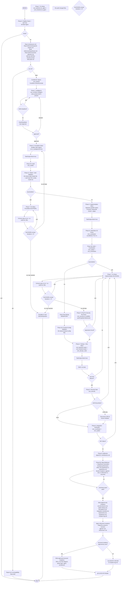

# Executable Flow Diagram

When invoked via `/flow:viable-swarm-model`, follow this diagram. At diamond
decision nodes, output `<choice>branch name</choice>` to select the next step.

```mermaid
flowchart TD
    BEGIN([BEGIN])
    P0[Phase 0: Viability Check + Self-Test<br/>S5 Main Agent]
    P0D{<choice>trivial</choice>?}
    P0R[Read .kimi/lessons.md<br/>Read references/acquired-wisdom.md<br/>Read references/hypotheses.md<br/>Read references/meta-reflection.md<br/>Self-test skill files<br/>Classify prompt<br/>Write plan.md]
    P0E{<choice>env ok</choice>?}
    P0E_F[Report env incompatibility<br/>Stop build]
    P0P[Conditional: Spawn vsm_product<br/>If problem-oriented prompt]
    P1[Phase 1: Intelligence<br/>vsm_architect subagent<br/>Uses product brief if present]
    P1H{<choice>S3/S4 deadlock</choice>?}
    P1A[EnterPlanMode<br/>User Approval]
    P1D{<choice>approved</choice>?}
    P2[Phase 2: Foundation Wave<br/>parallel coder agents<br/>run_in_background=true]
    P2S[TaskOutput block=true]
    P2A[Phase 2b: Audit<br/>vsm_auditor]
    P2M[Phase 2c: Model + Auth Validation<br/>S5 checks data models file + auth layer file vs data-model.md]
    P2D{<choice>BLOCKERs</choice>?}
    P3[Phase 3: Implementation Wave<br/>Backend: parallel routers<br/>Frontend: sequential shared→pages]
    P3S[TaskOutput block=true]
    P3M["Phase 3c: Mid-Wave S2 Check<br/>vsm_coordinator (conditional, Tier 2+)"]
    P3A[Phase 3b: Audit + Coordination<br/>vsm_auditor + vsm_coordinator]
    P3D{<choice>BLOCKERs</choice>?}
    P3E[Entry Point Wiring<br/>MANDATORY]
    P3D2[Phase 3d: Frontend Config Validation<br/>S5 checks frontend config files]
    P4[Phase 4: Testing + Infra Wave<br/>vsm_backend_tester + vsm_frontend_tester + vsm_devops_coder]
    P4S[TaskOutput block=true]
    P4R[Shell: run tests]
    P4G{zero test<br/>failures?}
    P5[Phase 5: Security Gate<br/>vsm_security]
    P5D{<choice>CRITICAL/HIGH</choice>?}
    P5L[Document LOW as<br/>known limitation]
    P6[Phase 6: Integration Verification<br/>vsm_coordinator + vsm_auditor]
    P6D{<choice>ANY failure</choice>?}
    P7[Phase 7: Fix Wave<br/>vsm_backend_fix_agent + vsm_frontend_fix_agent]
    P7R[Re-audit changed files]
    P7D{<choice>BLOCKERs remain<br/>iterations < 3</choice>?}
    P7E[Escalate to User<br/>AskUserQuestion]
    P7S[Phase 7c Post-Fix Security Re-Check<br/>vsm_security on modified auth/GraphQL/WebSocket]
    P7F{<choice>regressions found</choice>?}
    P8[Phase 8: Reflection<br/>Append to .kimi/lessons.md]
    P8M[Phase 8b: Meta-Reflection + Hypothesis Generation<br/>Evaluate performance<br/>Write new hypotheses to hypotheses.md<br/>Bucket mutations: append-only vs refinement vs structural]
    P8V{.kimi/meta-report<br/>valid?}
    P8W[Write append-only mutations<br/>security-lessons.md, pattern-library.md,<br/>anti-patterns.md, integration-checklist.md,<br/>experiments.md, hypotheses.md,<br/>mutation-log.md]
    P8R[Apply refinement mutations<br/>Single file, preserve structure<br/>agents/*.md, references/*.md]
    P8A{<choice>structural mutations<br/>approved by user</choice>?}
    P8WS[Write approved structural mutations<br/>SKILL.md, flow diagram,<br/>phase logic, agent architecture]
    P8L[Log rejection rationale<br/>to mutation-log.md]
    P8C[git commit all changes]
    END([END])

    BEGIN --> P0
    P0 --> P0D
    P0D -->|<choice>yes</choice>| END
    P0D -->|<choice>no</choice>| P0R
    P0R --> P0E
    P0E -->|<choice>pass</choice>| P0P
    P0E -->|<choice>fail</choice>| P0E_F
    P0E_F --> END
    P0P --> P1
    P1 --> P1H
    P1H -->|<choice>yes</choice>| P1
    P1H -->|<choice>no</choice>| P1A
    P1A --> P1D
    P1D -->|<choice>rejected</choice>| P1
    P1D -->|<choice>approved</choice>| P2
    P2 --> P2S
    P2S --> P2A
    P2A --> P2M
    P2M --> P2D
    P2D -->|<choice>yes</choice>| P7_FOUNDATION
    P2D -->|<choice>no</choice>| P3
    P3 --> P3S
    P3S --> P3M
    P3M --> P3A
    P3A --> P3D
    P3D -->|<choice>yes</choice>| P7_IMPL
    P3D -->|<choice>no</choice>| P3E
    P3E --> P3D2
    P3D2 --> P4
    P4 --> P4S
    P4S --> P4R
    P4R --> P4G
    P4G -->|<choice>yes</choice>| P5
    P4G -->|<choice>no</choice>| P7_IMPL
    P5 --> P5D
    P5D -->|<choice>yes</choice>| P7_IMPL
    P5D -->|<choice>LOW only</choice>| P5L
    P5D -->|<choice>none</choice>| P6
    P5L --> P6
    P6 --> P6D
    P6D -->|<choice>yes</choice>| P7_IMPL
    P6D -->|<choice>no</choice>| P8
    P7_FOUNDATION[Phase 7: Fix Wave<br/>Foundation BLOCKERs]
    P7_FOUNDATION --> P7R_F[Full test suite re-run + re-audit ALL files]
    P7R_F --> P7D_F{BLOCKERs remain<br/>iterations < 3?}
    P7D_F -->|<choice>yes</choice>| P7_FOUNDATION
    P7D_F -->|<choice>no, max reached</choice>| P7E
    P7D_F -->|<choice>no, all clear</choice>| P2
    P7_IMPL[Phase 7: Fix Wave<br/>Implementation BLOCKERs]
    P7_IMPL --> P7R_I[Full test suite re-run + re-audit ALL files]
    P7R_I --> P7D_I{BLOCKERs remain<br/>iterations < 3?}
    P7D_I -->|<choice>yes</choice>| P7_IMPL
    P7D_I -->|<choice>no, max reached</choice>| P7E
    P7D_I -->|<choice>no, all clear</choice>| P7S
    P7S --> P7F
    P7F -->|<choice>yes</choice>| P7_IMPL
    P7F -->|<choice>no</choice>| P4
    P7E --> END
    P8 --> P8M
    P8M --> P8V
    P8V -->|<choice>yes</choice>| P8W
    P8V -->|<choice>no</choice>| P8M
    P8W --> P8R
    P8R --> P8A
    P8A -->|<choice>yes</choice>| P8WS
    P8A -->|<choice>no</choice>| P8L
    P8WS --> P8C
    P8L --> P8C
    P8C --> END
```
