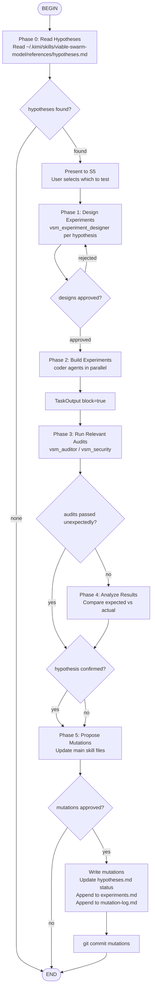

## 1. Overview

The `vsm-fitness-gym` is the **gym** of the ecosystem. While the
athlete (`viable-swarm-model`) performs in real games, the gym provides
**isolated equipment for targeted workouts** — minimal, controlled experiments
designed to test one specific muscle (one falsifiable claim) at a time.

**Mental model**: If `vsm-fitness-gym` is the gym, then
`viable-swarm-model` is the athlete (does the real work) and
`vsm-fitness-coach` is the coach (designs the training program).

**Scientific method embedded:**
1. **Observe** — Read the main skill's hypothesis backlog
2. **Select** — Pick 1-3 untested hypotheses relevant to current concerns
3. **Design** — Create a minimal reproducible experiment for each
4. **Run** — Build the experiment, run the relevant agent audits
5. **Analyze** — Did the main skill catch the issue? Was there a false positive?
6. **Report** — Update hypothesis status, propose mutations, write to experiment log

**Primary invocation**: `/flow:vsm-fitness-gym` executes the experiment workflow.  
**Example**: `/flow:vsm-fitness-gym Test hypotheses H2, H7, H12`

**Path convention**: This skill assumes the main skill is installed at
`~/.kimi/skills/viable-swarm-model/viable-swarm-model/`. If installed elsewhere,
adjust paths in Shell commands.

## 2. How to Invoke

- **`/flow:vsm-fitness-gym [hypothesis IDs or description]`** — Execute
  the experiment workflow. The chamber reads the main skill's hypotheses.md,
  selects untested items, designs experiments, runs them, and records results.
- **`/skill:vsm-fitness-gym`** — Load as knowledge reference.

## 3. Experiment Agent Types

| Role | CLI Implementation | Custom Type | Activation | Produces |
|---|---|---|---|---|
| **S5 (Policy)** | Main conversation agent | — | Always | Hypothesis selection, mutation approval |
| **S4 (Designer)** | `vsm_experiment_designer` | Custom | Phase 1 | Experiment spec, minimal code plan |
| **S1 (Builder)** | `coder` subagent | Built-in | Phase 2 | Minimal experiment code |
| **S3* (Tester)** | `vsm_auditor` or `vsm_security` | Custom | Phase 3 | PASS/ISSUES/BLOCKER on experiment |
| **S2 (Analyzer)** | Main agent | — | Phase 4 | Result analysis, mutation proposal |

### Custom Type Prompt Characteristics

**`vsm_experiment_designer`** (S4 Designer):
- Reads a hypothesis from the main skill's backlog
- Designs the SMALLEST possible experiment that can falsify the hypothesis
- Isolates variables: only the specific code pattern being tested
- Produces: experiment spec with file list, expected outcome, success criteria
- Never builds full applications — only minimal test cases

## 4. The Golden Rule of Parallelism

```
Independent experiments -> run_in_background=true (parallel, up to 4)
Dependent experiments   -> sequential (TaskOutput block=true before next)
```

## 5. Executable Flow Diagram



## 6. Phase Details

### Phase 0: Read Hypotheses
Read `~/.kimi/skills/viable-swarm-model/viable-swarm-model/references/hypotheses.md`.
Filter for `status: untested`. Present to user (S5) for selection.

### Phase 1: Design Experiments
For each selected hypothesis, spawn `vsm_experiment_designer` subagent.
The designer produces a minimal experiment spec:
- **Files needed**: usually 1-3 files (e.g., one route handler, one model, one test)
- **The code**: intentionally contains the bug/vulnerability/gap being tested
- **Expected agent behavior**: what the main skill's auditor/security SHOULD catch
- **Success criteria**: how we know the hypothesis is confirmed or rejected

### Phase 2: Build Experiments
Spawn parallel `coder` subagents. Each builds its experiment in a temporary
directory (e.g., `~/vsm-fitness-builds/gym/H7/`). No scaffolding beyond what's needed
to run the relevant audit.

### Phase 3: Run Relevant Audits
Spawn the main skill's custom agents against the experiment code:
- Security hypothesis → `vsm_security`
- Integration hypothesis → `vsm_coordinator`
- Audit hypothesis → `vsm_auditor`
- Pattern hypothesis → `vsm_architect` (design review)

If the agent **catches** the issue → hypothesis may be rejected (skill already knows).
If the agent **misses** the issue → hypothesis confirmed (gap exists).

### Phase 4: Analyze Results
Compare expected vs. actual agent behavior.
- **Confirmed**: The main skill has a genuine gap. Propose a mutation.
- **Rejected**: The main skill already handles this. Update hypothesis status.
- **Inconclusive**: Experiment design was flawed. Redesign and retry (max 2).

### Phase 5: Propose Mutations
If hypothesis confirmed, propose specific changes to the main skill:
- Append prevention rule to `security-lessons.md`
- Append check to `integration-checklist.md`
- Refine agent prompt in `custom-agent-prompts.md`
- Update `hypotheses.md` status: `confirmed`
- Append full record to `experiments.md`

Write mutation rationale to main skill's `mutation-log.md`.
`git commit` all changes.

## 7. Experiment Design Principles

1. **Minimal surface**: Test ONE hypothesis with the smallest possible code.
   A 50-line experiment is better than a 500-line one.
2. **Isolated variables**: Only the specific pattern being tested should be
   present. Remove distractions.
3. **Deterministic**: The experiment should produce the same result every time.
4. **Fast**: An experiment should run in minutes, not hours.
5. **Safe**: Experiments contain intentional bugs, but they run in isolated
   directories (`~/vsm-fitness-builds/gym/`) and don't affect real projects.

## 8. Epistemic Rules

1. **Negative results are results**: A rejected hypothesis is as valuable as a
   confirmed one. It prevents the skill from accumulating false rules.
2. **Corrections beat deletions**: If a hypothesis is rejected, append a
   correction rather than deleting the hypothesis. The skill should learn what
   it already knows, not just what it doesn't.
3. **The main skill is the subject**: The evolution chamber does not mutate
   itself. It mutates the main skill based on experimental evidence.
